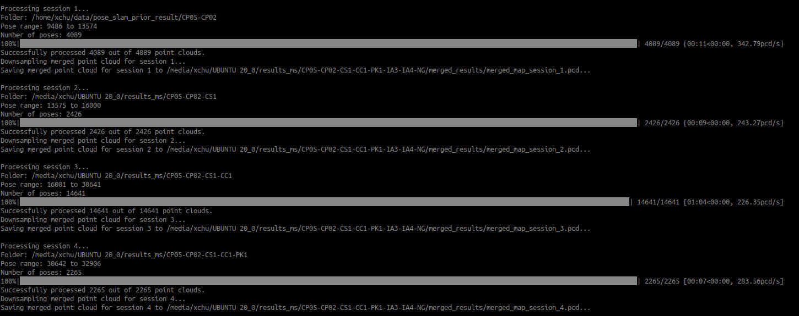
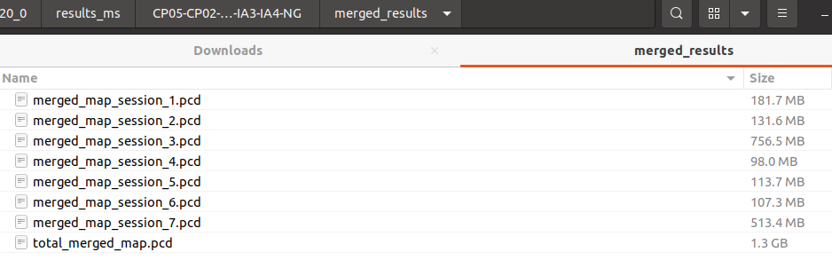
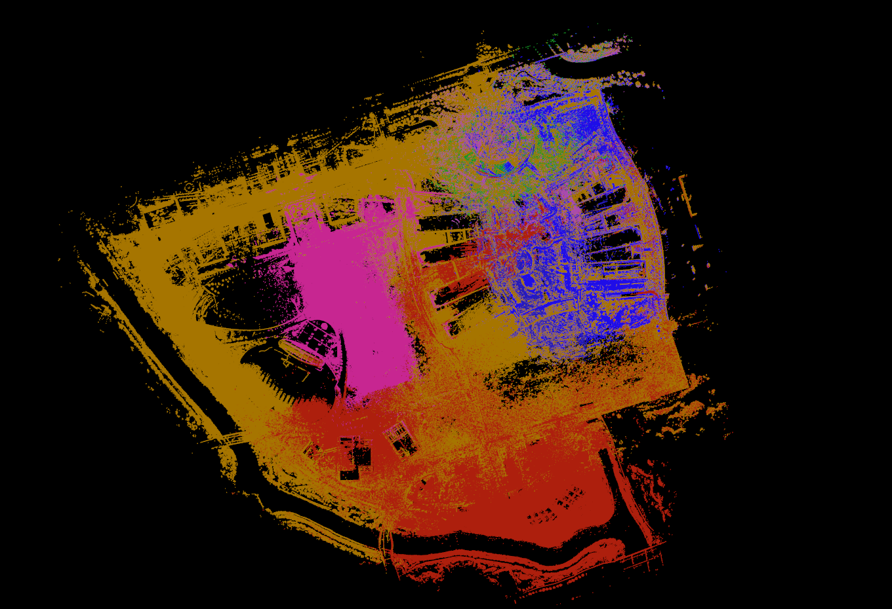
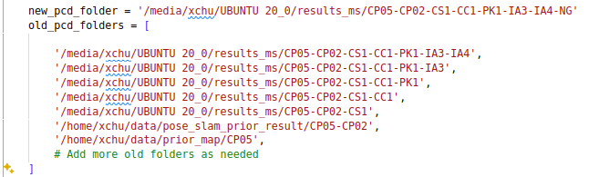
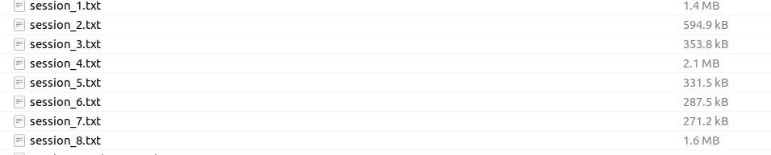
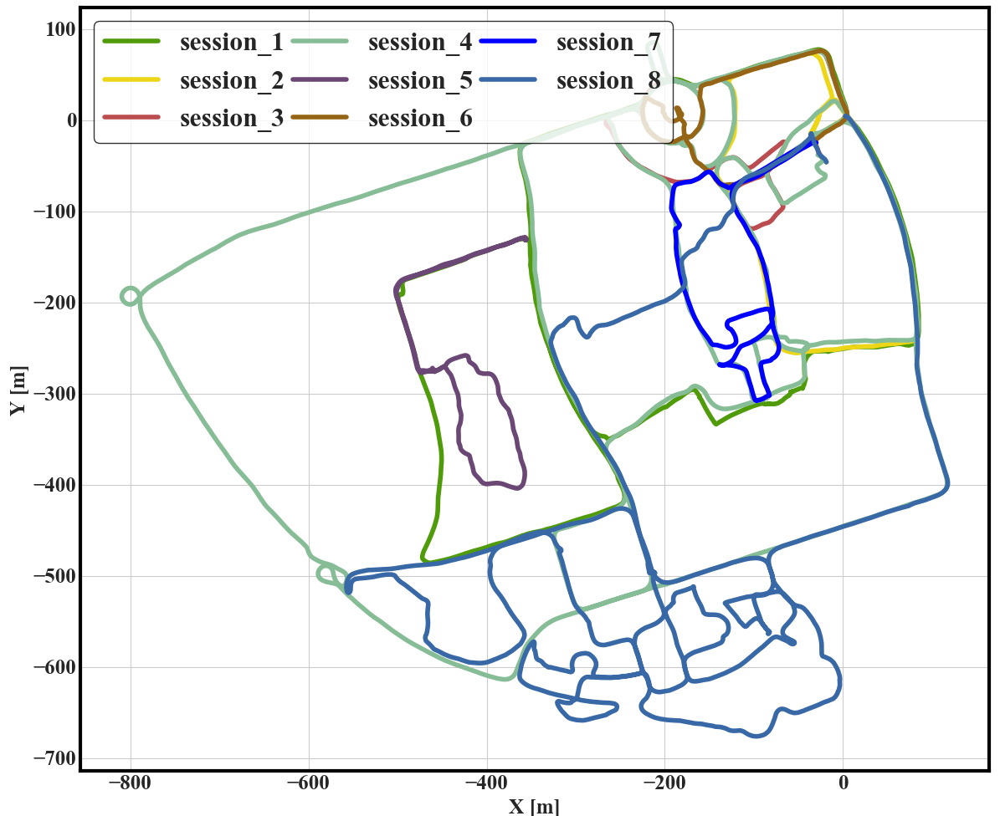
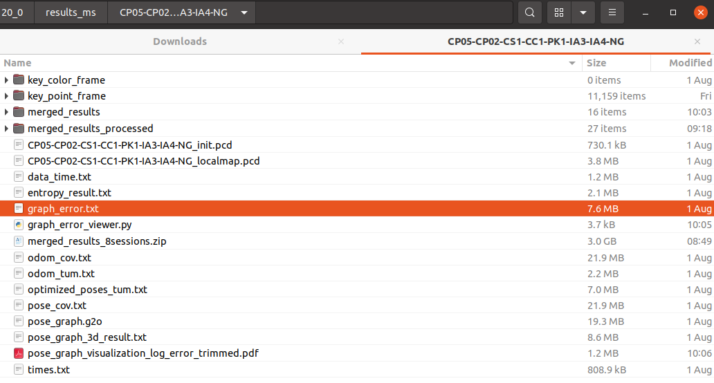
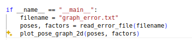
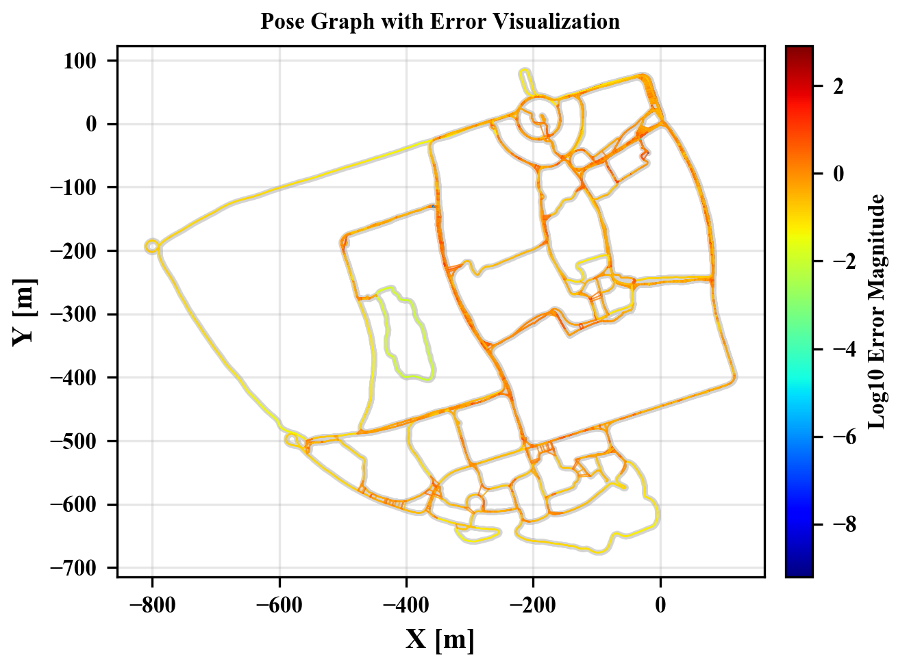

# MS-Mapping Tools

[TOC]

| Scripts                          | Test Data       |
| -------------------------------- | --------------- |
| Merge map                        | coming soon..   |
| Separate Trajectory              | coming soon..   |
| Visualize Graph Error Adjustment | graph_error.txt |
| Visualize Trajectory             | session_*.txt   |

## Merge map

Set your folder path,  if you use `CP2` to do incrimental mapping based on `CP5`, you must set the map folder of `CP2` as **new_pcd_folder**, and set all the map folder of  old sessions in the **old_pcd_folders**.

```python
# Configuration
new_pcd_folder = '/media/xchu/UBUNTU 20_0/results_ms/CP05-CP02-CS1-CC1-PK1-IA3-IA4-NG'

old_pcd_folders = [
    '/media/xchu/UBUNTU 20_0/results_ms/CP05-CP02-CS1-CC1-PK1-IA3-IA4',
    '/media/xchu/UBUNTU 20_0/results_ms/CP05-CP02-CS1-CC1-PK1-IA3',
    '/media/xchu/UBUNTU 20_0/results_ms/CP05-CP02-CS1-CC1-PK1',
    '/media/xchu/UBUNTU 20_0/results_ms/CP05-CP02-CS1-CC1',
    '/media/xchu/UBUNTU 20_0/results_ms/CP05-CP02-CS1',
    '/home/xchu/data/pose_slam_prior_result/CP05-CP02',
    # Add more old folders as needed
]
```

Run

```python
python3 multi-session-map-merger2.py
```

Finally we can get the merd point cloud map in `/media/xchu/UBUNTU 20_0/results_ms/CP05-CP02-CS1-CC1-PK1-IA3-IA4-NG/merged_results`





Run

```bash
pcl_viewer merged_map_session_*
```



## Separate Trajectory

The same setting as **Merge map**



Run

```python
python3 multi-session-map-merger_writetum.py
```



## Visualize Trajectory

Set the trajectory folder

```python
pose_folder = "/media/xchu/UBUNTU 20_0/results_ms/CP05-CP02-CS1-CC1-PK1-IA3-IA4-NG/merged_results"  # 请替换为实际的文件夹路径
```

Run

```python
python3 tum-trajectory-plotter.py
```



## Visualize Graph Error Adjustment

set the file path of **graph_error.txt**, this file will automatically saved after mapping.





Run

```python
python3 graph_error_viewer.py 
```

