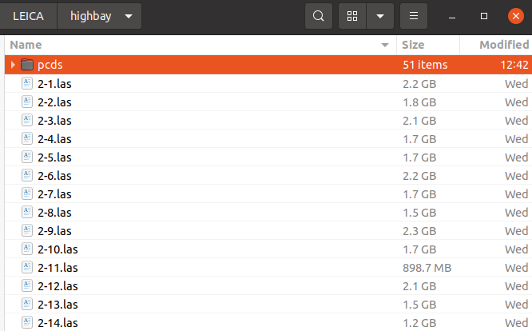
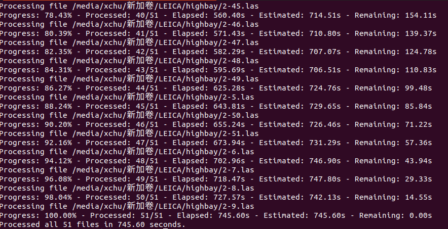
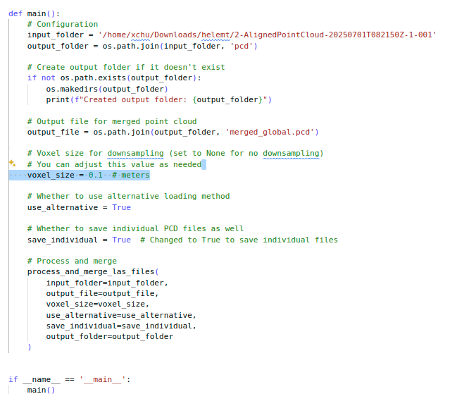
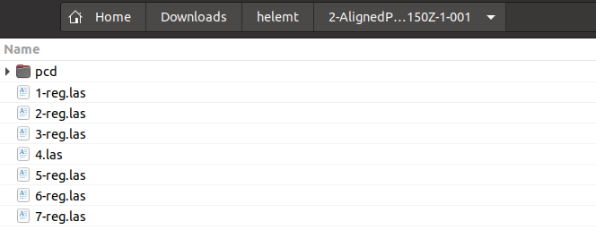
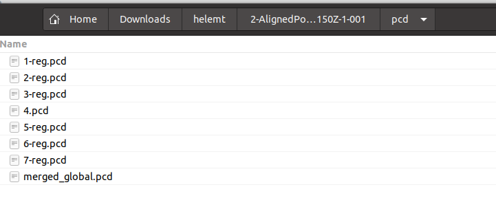
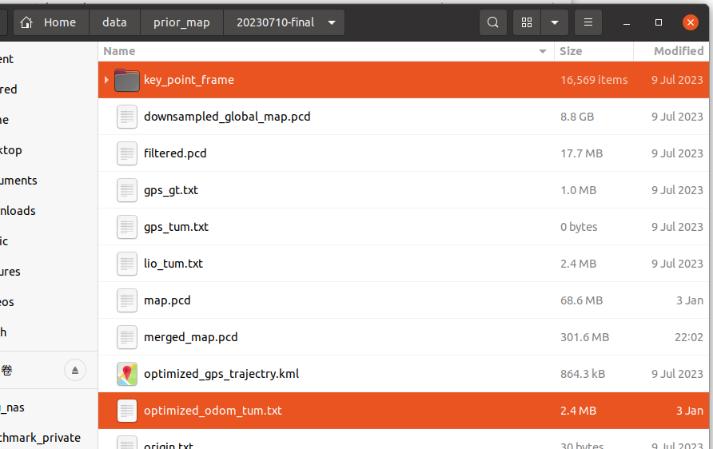
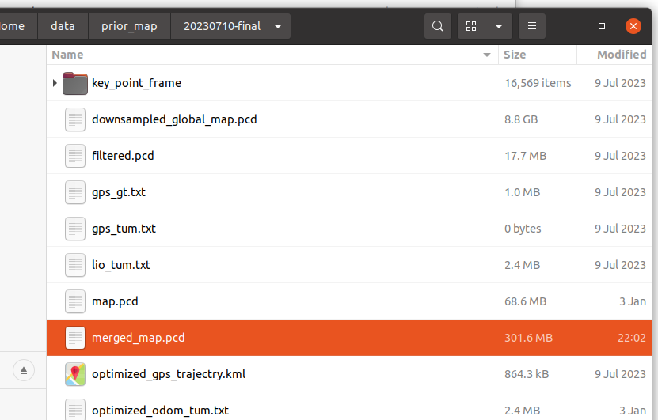
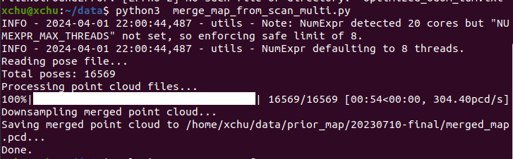

# LAS TO PCD

## covert_las_pcd

```python
    input_folder = '/media/xchu/新加卷/LEICA/highbay'
    main(input_folder, input_folder+'/pcds/')
```





## covert_las_pcd_multithread

multithread process

```python
    # set your thread number
    with multiprocessing.Pool(processes=10) as pool:
```

## merge_las_to_pcd.py

put the las file in the same folder and set the folder path, this script can merge all the las into a pcd file, together with single pcd files.

```python
python3 merge_las_to_pcd.py
```







## merge_map_from_scan

just install open3d

```python
pip3 install open3d
```

then set your folder

```python
#1.TUM file
#2.pcd folder

folder = '/home/xchu/data/prior_map/20230710-final/'
pose_file = folder + 'optimized_odom_tum.txt'
pcd_folder = folder + 'key_point_frame'
output_file = folder + 'merged_map.pcd'
```



then 

```
python3 merge_map_from_scan.py 
```

## merge_map_from_scan_multi

```python
pip3 install tdqm
python3 merge_map_from_scan_multi.py 
```




