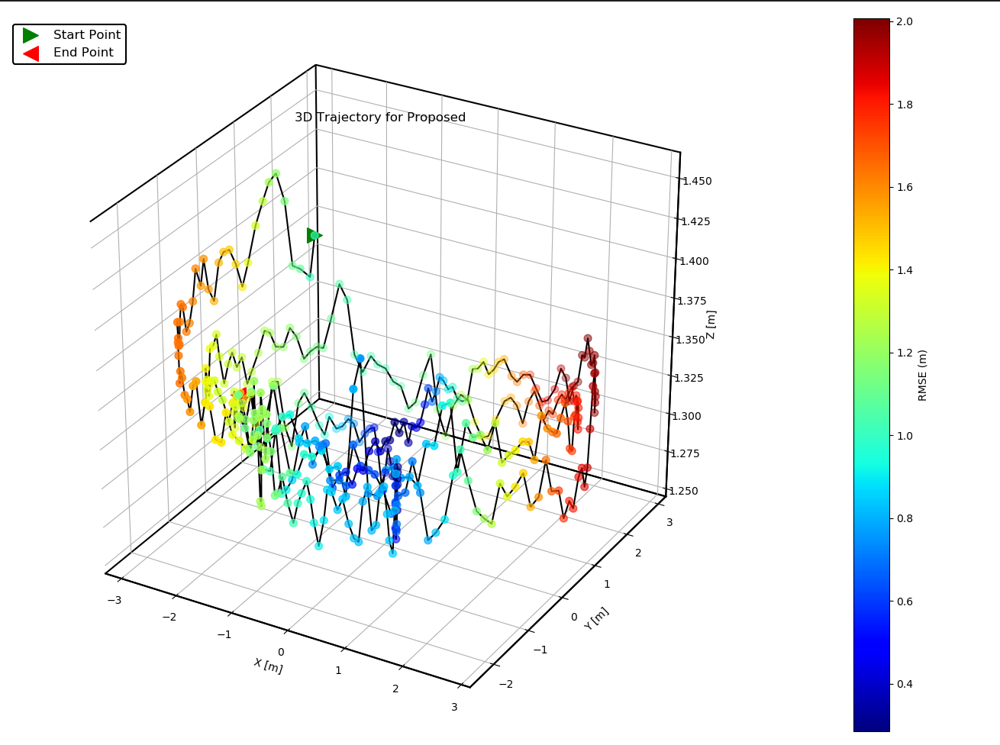
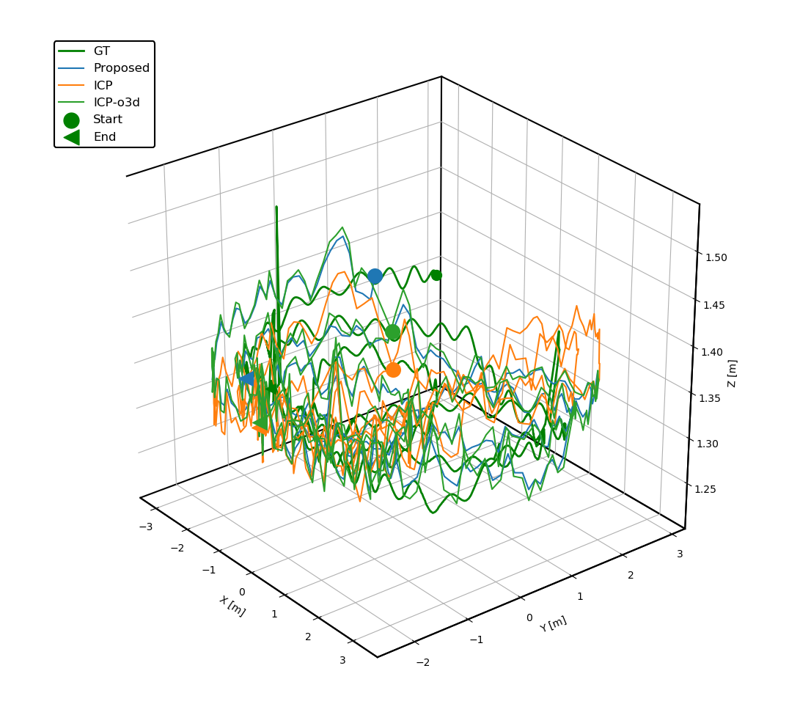

# SLAMTools


Our sensor suit:


## Viewer

### Evaluate with EVO results

first get evo ape and rpe results as `test.zip` and `test_rpe.zip`

```python
#dependence
pip3 install zipfile pandas matplotlib numpy
#run
python3 evo_eval_viewer.py
```


### Run_time_analysis

```python
#denpendence
pip3 install matplotlib pandas

#run
python3 time_analysis.py

# 1698490753.03 0.135222 221.497434 0.022776 0.491802 236.377261 0.651435 1194.924191 0.132663 3.51924 0
# timestamp module1_time module2_time module3_time module4_time total_time module1_total_time module2_total_time module13_tota_time module4_total_time 
# since we just use module2_time and module4_time, we can get the following figure.
# ref to paper: PALoc https://ieeexplore.ieee.org/document/10480308
```


### pose_graph_cov_2d


### tum_traj_viewer


### tum_rpy_viewer


### var_analysis


## Evaluation

### eval_rpy_viewer.py


### eval_xyz_viewer


### eval_xyz_viewer_colorbar





