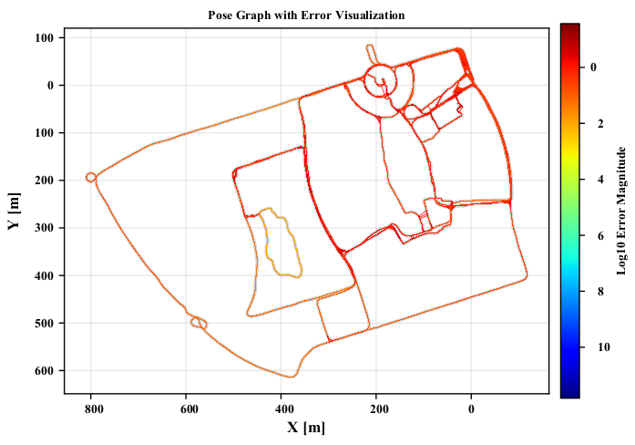

# SLAMTools

This is a script toolkit for SLAM research, including but not limited to various plotting functions, ROS bag processing, and more.

| Function                                  | scripts | demo                                                         |
| ----------------------------------------- | ------- | ------------------------------------------------------------ |
| Plot Error with EVO results               |         |  |
| Plot comparative Error                    |         |  |
| Plot Graph error                          |         |  |
| Plot Error with colorbar                  |         |  |
| Plot pose cov                             |         |  |
| Visualize 2D/3D trajectory                |         |  |
| Visualize RPY                             |         |  |
| Visualize Position and rotation over time |         |  |
| Analysis  GNSS covariance                 |         |  |
| Run-time  analysis                        |         |  |
| Run-time analysis comparative             |         |  |


## Viewer

### Evaluate with EVO results

first get evo ape and rpe results as `test.zip` and `test_rpe.zip`

```python
#dependence
pip3 install zipfile pandas matplotlib numpy
#run
python3 evo_eval_viewer.py
```

### Run_time_analysis

```python
#denpendence
pip3 install matplotlib pandas

#run
python3 time_analysis.py

# 1698490753.03 0.135222 221.497434 0.022776 0.491802 236.377261 0.651435 1194.924191 0.132663 3.51924 0
# timestamp module1_time module2_time module3_time module4_time total_time module1_total_time module2_total_time module13_tota_time module4_total_time 
# since we just use module2_time and module4_time, we can get the following figure.
# ref to paper: PALoc https://ieeexplore.ieee.org/document/10480308
```

### pose_graph_cov_2d

### tum_traj_viewer

### tum_rpy_viewer

### var_analysis

## Evaluation

### eval_rpy_viewer.py

### eval_xyz_viewer

### eval_xyz_viewer_colorbar


## NCLT Tools

### merge raw data to rosbag

this scripts is modified from faster-lio, but fix some bugs.

set your data file


```bash
python3 sensordata_to_rosbag_fastlio.py 2012-01-22/ 2012-01-22.bag
```

### TUM GT Trajectory

download the gt and cov file.

```python
python3 generate_gt.py groundtruth_2012-01-15.csv cov_2012-01-15.csv groundtruth_2012-01-15-tum.txt
```


### Read GT

```bash
python3 read_ground_truth.py groundtruth_2012-01-08.csv cov_2012-01-08.csv
```


## Contributors

<a href="https://github.com/JokerJohn/SLAMTools/graphs/contributors">
  
</a>
