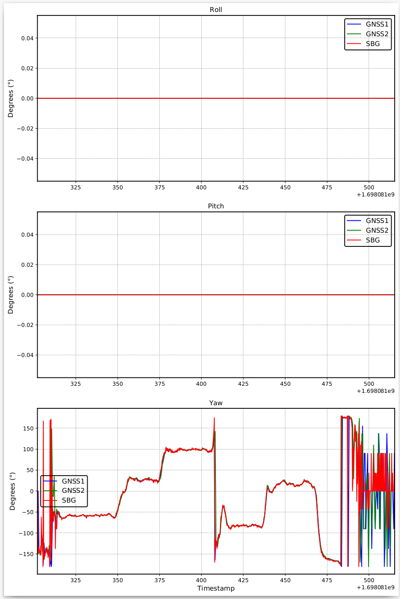

# SLAMTools
Bag process and evalutaion tools for Dual Antenna RTK Suit

Our sensor suit:

## Viewer

### tum_traj_viewer

### tum_rpy_viewer

### var_analysis

## Evaluation

### eval_rpy_viewer.py

### eval_xyz_viewer.py

