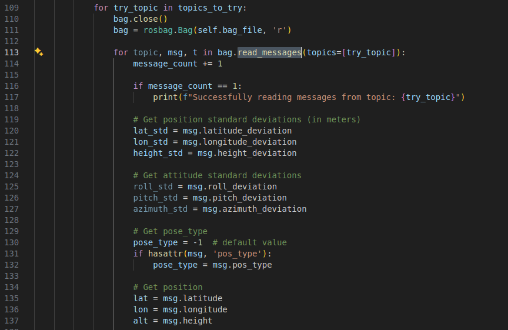
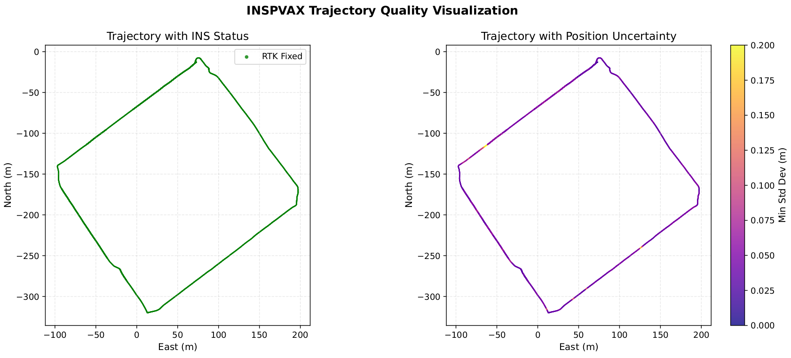

# Usage

## Extract gnss data from ROSBAG with cov

set your bag path and topic name, file name, gnss origin.

```python
# 请替换为实际GNSS origin
origin = {'lat': 22.8901710523756, 'lon': 113.47589813609757, 'alt': 0.07678306745241956}  

# Path to the rosbag file
bag_file = 'sample.bag'  # Replace with your rosbag path
```

for nav_msgs:Odometry msgs, set the paramers

```python
# 斜方差阈值
variance_threshold = 0.5

for topic, msg, t in bag.read_messages(topics=['/3dm_ins/nav/odom']):
```

```python
python3 ins_extractor.py
```

we got the following file:


for NavSatFix message, set the NavSatFix topic and variance_threshold

```python
# only support NavSatFix message type
configurations = [
    {
        'topic': '/3dm_ins/gnss1/fix',
        'output_file': 'output_gnss1_tum.txt',
        'variance_threshold': 0.8
    },
    {
        'topic': '/3dm_ins/gnss2/fix',
        'output_file': 'output_gnss2_tum.txt',
        'variance_threshold': 0.1
    },
    {
        'topic': '/imu/nav_sat_fix',
        'output_file': 'output_gnss_sbg_tum.txt',
        'variance_threshold': 100
    }
]
```

then

```python3
python3 var_extractor_gnss.py
```

we got the following file:


## [var_analysis.py](RTK_GT_Extractor/var_analysis.py) 

for visualize these trajectories, we should set the file path:

```python3
# 提取数据
data_gnss1 = read_tum_with_variance_for_visualization("demo_results/output_gnss1_tum_with_variance.txt")
data_gnss2 = read_tum_with_variance_for_visualization("demo_results/output_gnss2_tum_with_variance.txt")
data_gnss3 = read_tum_with_variance_for_visualization("demo_results/output_gnss_sbg_tum_with_variance.txt")
data_gnss4 = read_tum_with_variance_for_visualization("demo_results/sample_ins_tum_with_variance.txt")
```

then 

```
python3 var_analysis.py
```

we can got the demo results, four types of GNSS trajectories, then tune the cov, we can save your results as GT path.


##  [rosbag_trajectory_viz.py](RTK_GT_Extractor/nclt_style/rosbag_trajectory_viz.py)

1. extract ins data from rosbag, including 
   - Trajectory data: 2_gt.csv
     - Covariance data: 2_cov.csv (all points)
     - TUM format: 2_tum.txt (high-quality only)
     - Visualization PDF: 2_trajectory_quality.pdf

 	2. shw the ins status and point quality of the trajectory so that we can set a proper threshold to filter the ground truth points.

```python
# set your bagfile, origin point LLA ins_topic_name
bag_file = '2.bag'  # rosbag file path
topic_name = 'fixposition/inspvax'  # INSPVAX message topic

# For 2.bag
origin = {
    'lon': 114.00,
    'lat': 22.00,
    'alt': 4.000
}
    
# other parameters
# Filter parameters for TUM file
std_dev_threshold = 0.1  # Position std threshold (meters)
valid_pose_types = [50]  # Valid pose_type values (50=RTK Fixed)

# Filter mode for TUM file:
# filter_mode = 'std_only'       # Only use std filter
# filter_mode = 'pose_type_only' # Only use pose_type filter
filter_mode = 'both'           # Both conditions must be met (recommended)

use_first_as_origin = False  # Whether to use first valid point as origin

# Run mode selection
# mode = 'extract'    # Extract from rosbag
# mode = 'visualize'  # Only visualize existing data
mode = 'auto'       # Auto mode: ask if data files exist
```

next, set your script according your own ins data type.



run

```python3
python3 rosbag_trajectory_viz.py
```


