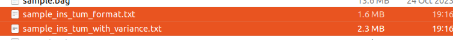

# Usage

## Extract gnss data from ROSBAG with cov

set your bag path and topic name, file name, gnss origin.

```python
# 请替换为实际GNSS origin
origin = {'lat': 22.8901710523756, 'lon': 113.47589813609757, 'alt': 0.07678306745241956}  

# Path to the rosbag file
bag_file = 'sample.bag'  # Replace with your rosbag path
```

for nav_msgs:Odometry msgs, set the paramers

```python
# 斜方差阈值
variance_threshold = 0.5

for topic, msg, t in bag.read_messages(topics=['/3dm_ins/nav/odom']):
```

```python
python3 ins_extractor.py
```

we got the following file:



for NavSatFix message, set the NavSatFix topic and variance_threshold

```python
# only support NavSatFix message type
configurations = [
    {
        'topic': '/3dm_ins/gnss1/fix',
        'output_file': 'output_gnss1_tum.txt',
        'variance_threshold': 0.8
    },
    {
        'topic': '/3dm_ins/gnss2/fix',
        'output_file': 'output_gnss2_tum.txt',
        'variance_threshold': 0.1
    },
    {
        'topic': '/imu/nav_sat_fix',
        'output_file': 'output_gnss_sbg_tum.txt',
        'variance_threshold': 100
    }
]
```

then

```python3
python3 var_extractor_gnss.py
```

we got the following file:


## Visualize the GNSS trajectory

for visualize these trajectories, we should set the file path:

```python3
# 提取数据
data_gnss1 = read_tum_with_variance_for_visualization("demo_results/output_gnss1_tum_with_variance.txt")
data_gnss2 = read_tum_with_variance_for_visualization("demo_results/output_gnss2_tum_with_variance.txt")
data_gnss3 = read_tum_with_variance_for_visualization("demo_results/output_gnss_sbg_tum_with_variance.txt")
data_gnss4 = read_tum_with_variance_for_visualization("demo_results/sample_ins_tum_with_variance.txt")
```

then 

```
python3 var_analysis.py
```

we can got the demo results, four types of GNSS trajectories, then tune the cov, we can save your results as GT path.

