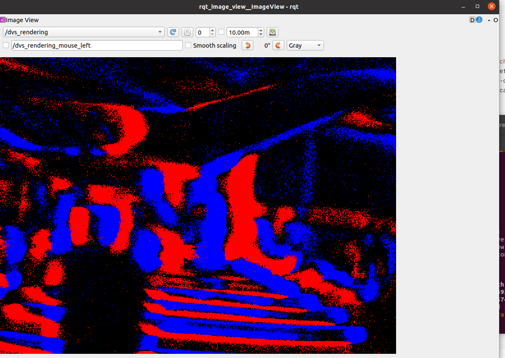
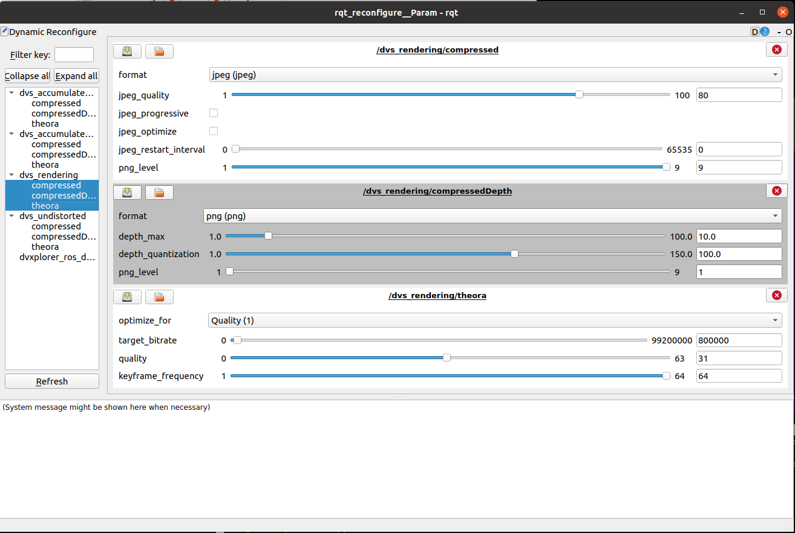

## DVXPlorer

the tutorial can be used for ubuntu 16.04(kinetic)/18.04 (melodic)/20.04(noetic).

read this toturial: https://github.com/uzh-rpg/rpg_dvs_ros

```bash
# 1.install the  libcaer
git clone https://gitlab.com/inivation/dv/libcaer.git

cd libcaer
mkdir build 
cd build
cmake ..
sudo make install -j4

# install ROS dependencies, change to your ros version 
sudo apt-get install ros-kinetic-camera-info-manager ros-kinetic-image-view
sudo apt-get install python3-catkin-tools # ROS Melodic or ROS Noetic, use catkin build
sudo apt-get install python-catkin-tools  #(if ROS Kinetic)

# ros
mkdir -p catkin_ws/src
cd catkin_ws
catkin config --init --mkdirs --extend /opt/ros/kinetic --merge-devel --cmake-args -DCMAKE_BUILD_TYPE=Release

cd ~/catkin_ws/src
git clone https://github.com/catkin/catkin_simple.git
git clone https://github.com/uzh-rpg/rpg_dvs_ros.git

# run ros driver
catkin build dvs_ros_driver #(if you are using the DVS128)
catkin build davis_ros_driver #(if you are using the DAVIS)
catkin build dvxplorer_ros_driver #(if you are using the DVXplorer)

# You can test the installation by running a provided launch file. It starts the driver (DVS or DAVIS) and the renderer (an image viewer).
catkin build dvs_renderer
source ~/catkin_ws/devel/setup.bash

#befor lanuch driver, check the permit of your use port
sudo chmod 777 /dev/bus/usb/002/003

roslaunch dvs_renderer dvs_mono.launch #(if you are using the DVS128)
roslaunch dvs_renderer davis_mono.launch #(if you are using the DAVIS)
roslaunch dvs_renderer dvxplorer_mono.launch #(if you are using the DVXplorer) You should get an image like this (in case of the DAVIS)

# you can set the configure


```

