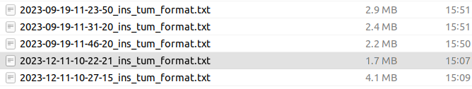
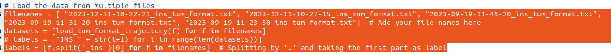
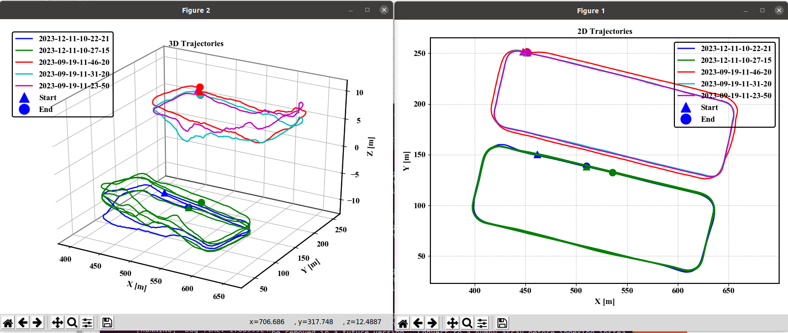

## multi-path

### extract your ins pose in tum format in the same frame using `ins_extractor_ins.py`



### set your file path in`tum_traj_viewer_multi_path.py`



```python3
python3 tum_traj_viewer_multi_path.py
```


